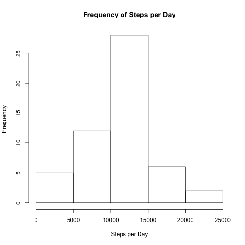
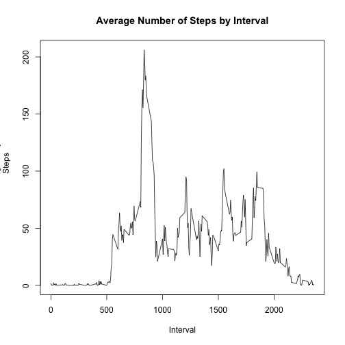
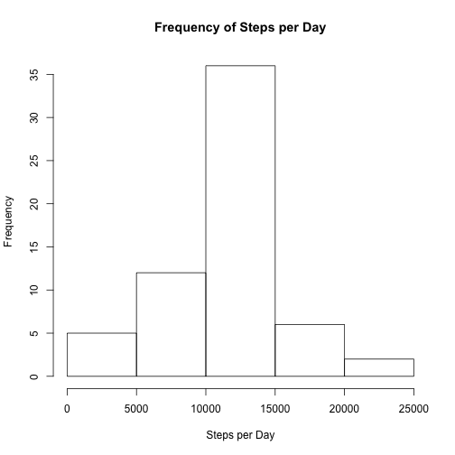
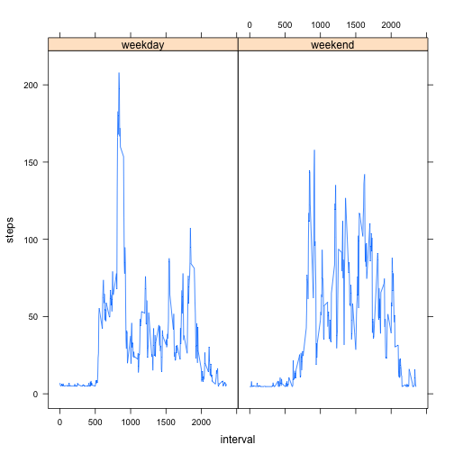

# Reproducible Research: Peer Assessment 1


## Loading and preprocessing the data

The following code will set the correct working directory and load my plotting 
package:


```r
setwd("~/Repository/Coursera/RepData_PeerAssessment1")
library(lattice)
```

The following code will read the data into R using the Read CSV function:


```r
data <- read.csv("activity.csv", header=TRUE)
```

## What is mean total number of steps taken per day?

The following code will calculate the number of Steps taken each day:


```r
stepsPerDay <- aggregate(formula=steps~date, data=data, FUN=sum, na.rm=TRUE)
```

The following code will construct a histogram of the total number of steps take
each day:


```r
hist(stepsPerDay$steps, xlab="Steps per Day", ylab="Frequency", 
    main="Frequency of Steps per Day")
```

 

The following code will calculate the mean and the median of the total number 
of steps taken each day:


```r
mean(stepsPerDay$steps, na.rm=TRUE)
```

```
## [1] 10766.19
```

```r
median(stepsPerDay$steps, na.rm=TRUE)
```

```
## [1] 10765
```

## What is the average daily activity pattern?

The following code will create a time series plot which shows the average 
number of steps taken, averaged across all days by interval:


```r
averageStepsPerInterval <- aggregate(formula=steps~interval, data=data, 
    FUN=mean)
plot(averageStepsPerInterval, type="l", xlab="Interval", ylab="Average Daily
    Steps", main="Average Number of Steps by Interval")
```

 

The following code will show which 5-minute interval, on average across all 
days, contains the maximum number of steps:


```r
averageStepsPerInterval$interval[which.max(averageStepsPerInterval$steps)]
```

```
## [1] 835
```

## Imputing missing values

The following code calculates the number of missing values in the dataset:


```r
sum(is.na(data$steps))
```

```
## [1] 2304
```

My strategy to fill in the missing values is to take the average value of the 
step column without the NAs and then to replace all of the NAs with that 
average.

The following code creates my dataset utilizing the above strategy to replace 
the NAs:


```r
averageSteps <- mean(data$steps, na.rm=TRUE)
data[is.na(data)] <- averageSteps
```

The following code creates the histogram of the total number of steps taken 
each day and calculates the mean and median per day:


```r
stepsPerDayNA <- aggregate(formula=steps~date, data=data, FUN=sum, na.rm=TRUE)
hist(stepsPerDayNA$steps, xlab="Steps per Day", ylab="Frequency", 
    main="Frequency of Steps per Day")
```

 

```r
mean(stepsPerDayNA$steps)
```

```
## [1] 10766.19
```

```r
median(stepsPerDayNA$steps)
```

```
## [1] 10766.19
```

In regards to the Mean and Median post NA replacement:
* The Mean has remained the same from the previous calculation
* The Median has increased slightly from the previous calculation

Broadly, the impact of imoutting missing data causes the estimate of total 
daily number of steps to increase.

## Are there differences in activity patterns between weekdays and weekends?

The following code will include in the dataset a new factor variable denoting whether a date is a weekday or a weekend:


```r
data$dayType <- as.POSIXlt(data$date)$wday
data$dayType <- replace(data$dayType,
    data$dayType==0, "weekend")
data$dayType <- replace(data$dayType, 
    data$dayType==1, "weekday")
data$dayType <- replace(data$dayType, 
    data$dayType==2, "weekday")
data$dayType <- replace(data$dayType, 
    data$dayType==3, "weekday")
data$dayType <- replace(data$dayType, 
    data$dayType==4, "weekday")
data$dayType <- replace(data$dayType, 
    data$dayType==5, "weekday")
data$dayType <- replace(data$dayType, 
    data$dayType==6, "weekend")
```

The following code creates a panel plot containing a time series plot of the 5-
minute interval and the average number of steps taken, averaged across all 
weekdays and weekend days:


```r
plotData <- aggregate(steps~interval+dayType, data, mean)
xyplot(steps~interval|factor(dayType), data=plotData, type="l")
```

 


